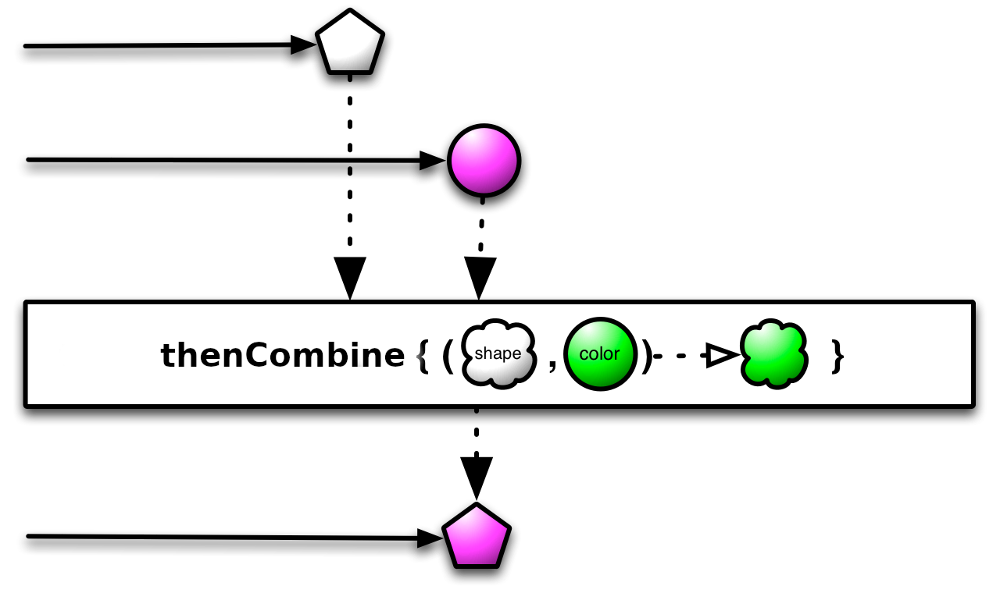

# CompletableFuture marble diagrams

This repository describes the `CompletableFuture` operations with marble diagrams. 
The `&#42;Async` methods are omitted intentionally (for brevity). The complete `CompletableFuture` documentation is available as link:https://docs.oracle.com/javase/8/docs/api/java/util/concurrent/CompletableFuture.html[javadocs], which unfortunately is not as good as link:https://twitter.com/@tnurkiewicz[Tomasz Nurkiewicz's] article: links:https://www.nurkiewicz.com/2013/05/java-8-definitive-guide-to.html[Java 8: Definitive guide to CompletableFuture].

The link:http://reactivex.io/documentation/single.html[ReactiveX] webpage is the source of marble diagram images.

## `thenApply`

[quote]
Returns a new CompletionStage that, when this stage completes normally, is executed with this stage's result as the argument to the supplied function. See the CompletionStage documentation for rules covering exceptional completion (link:https://docs.oracle.com/javase/8/docs/api/java/util/concurrent/CompletableFuture.html#thenApply-java.util.function.Function-[javadoc])

## `thenCompose`

[quote]
Returns a new CompletionStage that, when this stage completes normally, is executed with this stage as the argument to the supplied function. See the CompletionStage documentation for rules covering exceptional completion (link:https://docs.oracle.com/javase/8/docs/api/java/util/concurrent/CompletableFuture.html#thenCompose-java.util.function.Function-[javadoc])

## `thenCombine`

[quote]
Returns a new CompletionStage that, when this and the other given stage both complete normally, is executed with the two results as arguments to the supplied function. See the CompletionStage documentation for rules covering exceptional completion (link:https://docs.oracle.com/javase/8/docs/api/java/util/concurrent/CompletableFuture.html#thenCombine-java.util.concurrent.CompletionStage-java.util.function.BiFunction-[javadoc])

## `completedFuture`

[quote]
Returns a new CompletableFuture that is already completed with the given value (link:https://docs.oracle.com/javase/8/docs/api/java/util/concurrent/CompletableFuture.html#completedFuture-U-[javadoc])

## `applyToEither`

[quote]
Returns a new CompletionStage that, when either this or the other given stage complete normally, is executed with the corresponding result as argument to the supplied function. See the CompletionStage documentation for rules covering exceptional completion (link:https://docs.oracle.com/javase/8/docs/api/java/util/concurrent/CompletableFuture.html#applyToEither-java.util.concurrent.CompletionStage-java.util.function.Function-[javadoc])